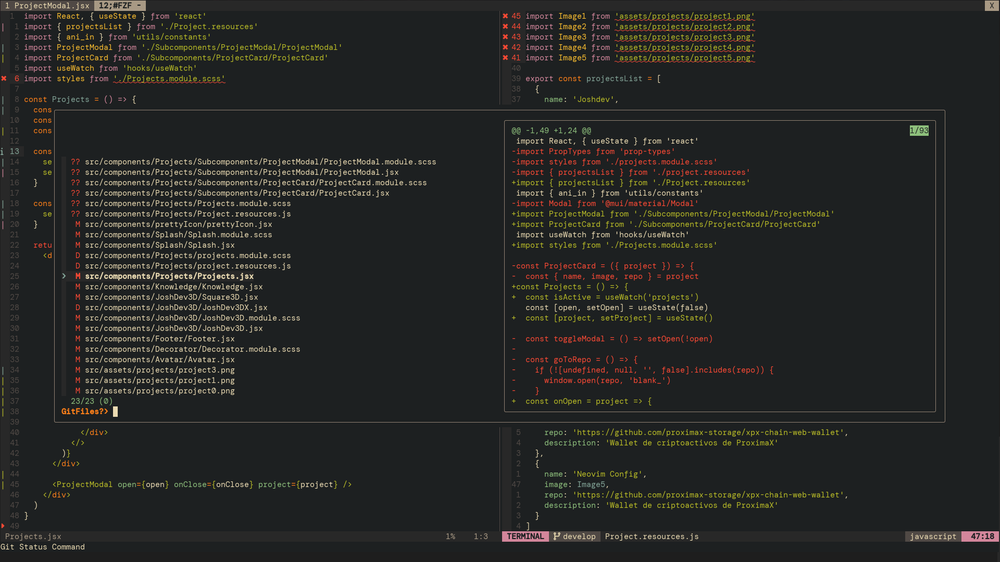

# Config



Custom configuration repository for nvim and zsh tools

To update, run the process.sh file:

```bash
bash process.sh
```

For complete operation of the packages please read
the following file: [INSTRUCTIONS](https://github.com/joshdev15/config/blob/master/.config/nvim/INSTRUCTIONS.md)


